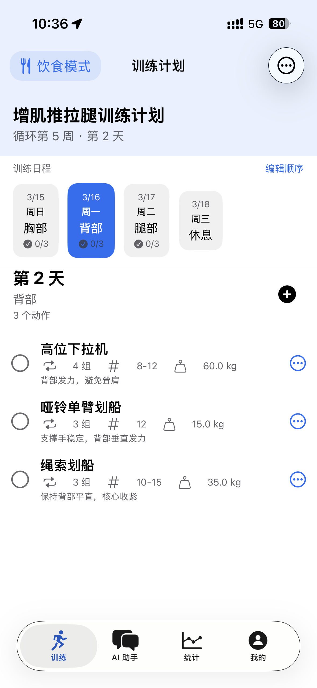
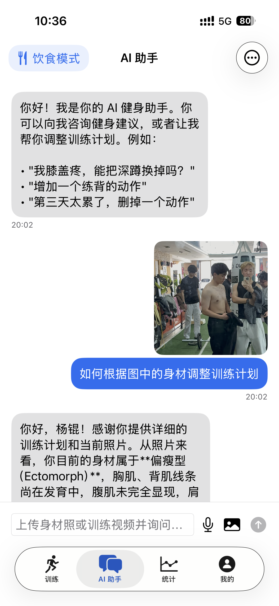
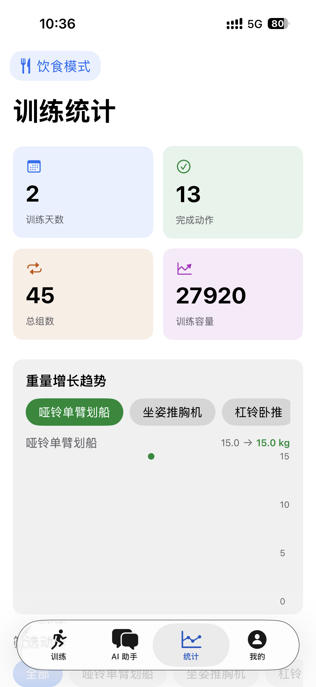
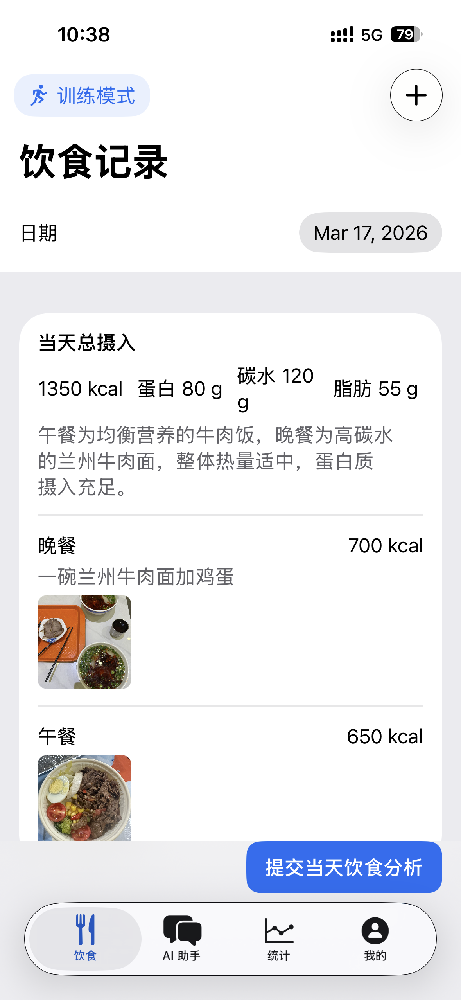
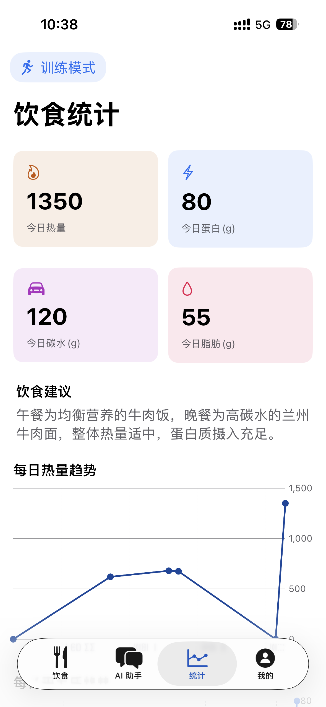

# FitGenius / Fit-Genius - AI 健身计划管理 iOS 应用

> **品牌名（App Store 用户可见）**
> - 中文区：**FitGenius**
> - 英文区：**Fit-Genius**（带连字符，避开英文区同名占用）
> - Slogan：让每一次训练都不白费
>
> **工程层标识（永远不变）**
> - Bundle ID：`com.swordingk.fitgenius`（已上架锁定）
> - App Group：`group.com.swordingk.fitgenius`
> - URL Scheme：`fitgenius://`

**一款基于 AI 的智能健身计划 + 饮食管理应用**

---

## App 预览

  
  
  
   
  
  

## 应用简介

FitGenius 是一款原生 iOS 健身应用，支持**训练计划管理**和**饮食追踪**双模式，通过 AI 技术为用户生成个性化训练计划，并提供智能饮食分析和营养建议。

AI 请求统一通过 Vercel 的 provider-neutral 代理；当前主用 MiniMax，Aliyun 仅作紧急回滚。iOS 包内不含任何第三方 API key。

### ✨ 核心特性

#### 🏋️ 训练模块
- 🤖 **AI 智能生成**：根据用户身体数据和健身目标，自动生成个性化训练计划
- 🔄 **灵活循环系统**：支持任意天数的训练循环（3天、4天、5天、7天等）
- 🎥 **动作分析教练**：支持在 AI 助手上传训练视频，使用 Apple Vision 本地识别深蹲、硬拉、卧推、站姿推举
- 🧠 **可解释反馈**：在真实视频截帧上绘制绿色骨架和红色重点位置，并输出评分、证据、修正方法和练习建议
- 📊 **数据统计分析**：训练容量趋势、重量增长曲线、坚持天数统计
- 💬 **AI 助手对话**：通过自然语言与 AI 交流，随时调整训练计划
- ✏️ **手动编辑**：支持手动修改训练动作、组数、次数和重量
- 🔥 **坚持天数追踪**：自动统计连续训练天数，激励用户坚持

#### 🍎 饮食模块
- 🍽️ **饮食记录**：支持文字和图片两种方式记录每日饮食
- 🤖 **AI 营养分析**：自动分析饮食内容，计算热量和三大营养素
- 📈 **营养趋势图表**：可视化展示每日热量、蛋白质、碳水、脂肪摄入趋势
- 💡 **饮食建议**：AI 根据训练目标提供个性化饮食建议
- 📸 **多模态识别**：支持拍照识别食物并自动分析营养成分

#### 📱 iOS 小组件
- ⚡️ **三类 Widget**：支持综合、训练、饮食小组件，可同时放在主屏幕
- 📊 **训练与营养概览**：展示今日训练进度、下一动作、热量和三大营养素比例
- 🎨 **系统背景**：自动适配 iOS 系统的深色/浅色模式

#### 🔐 隐私与安全
- 🍎 **Apple 登录**：支持 Sign in with Apple，保护用户隐私
- 📴 **本地优先**：数据主要存储在本地设备
- ☁️ **后端云同步**：登录后通过 Vercel + Neon 同步训练计划、饮食记录和账户快照
- 🔒 **健康免责声明**：所有健康建议均标注来源，仅供参考

---

## 🎯 功能详解

### 1. Onboarding 流程

用户首次使用时，通过简洁的引导流程输入：
- 基本信息（姓名、年龄、性别、身高、体重）
- 健身目标（增肌、减脂、塑形、提升力量）
- 训练环境（健身房、家庭）
- 可用器械
- 身体限制/伤病（可选）

AI 根据这些信息生成定制化训练计划。

### 2. 训练计划页面

**循环展示系统**：
- 显示完整的训练循环（不限于7天）
- 每天显示对应的日期和星期
- 自动定位到今天的训练
- 支持休息日标记
- 显示"循环第 X 周 · 第 Y 天"

**训练详情**：
- 每个动作显示：名称、组数、次数、重量、备注
- 一键标记完成状态
- 实时更新训练进度
- 支持手动编辑动作参数

### 3. AI 助手（训练 & 饮食）

**训练 AI 助手**：
- 自然语言交流
- 理解用户意图（修改计划、调整重量等）
- 返回结构化建议
- 支持动作分析（上传照片/视频）
- 训练视频走本地 Apple Vision + 规则引擎：自动识别深蹲、硬拉、卧推、站姿推举，输出真实视频截帧画线反馈
- 大模型只用于解释本地指标和生成教练式文字建议，不替代本地评分，也不上传原始训练视频

**饮食 AI 助手**：
- 饮食记录和营养分析
- 个性化饮食建议
- 食物照片识别与每餐热量/蛋白质/碳水/脂肪回写

### 4. 统计分析

**坚持天数统计**：
- 显示"你坚持训练计划已经 X 天"
- 今日全部完成 → 天数 +1
- 连续 2 天未完成 → 清零

**训练数据可视化**：
- 训练天数、完成动作数、总组数、训练容量
- 按日期的训练坚持情况（柱状图）
- 训练容量趋势（折线图）
- 每个力量动作的重量增长曲线

### 5. 饮食记录模块

**饮食记录方式**：
- **文字记录**：直接输入饮食内容（如"早餐：鸡蛋2个，牛奶250ml，全麦面包2片"）
- **拍照记录**：拍摄食物照片，AI 自动识别并分析
- **每餐营养**：每一餐独立显示热量、蛋白质、碳水和脂肪，并支持编辑或删除

**营养趋势**：
- 每日/每周热量和营养素摄入趋势
- 自动计算营养摘要

### 6. 个人中心

- Apple 登录同步
- 每日训练提醒设置
- Apple Watch 训练辅助入口
- Widget 使用说明
- 账户删除与本地数据重置

---

## 🔬 技术栈

### iOS
| 技术 | 说明 |
|------|------|
| SwiftUI | UI 框架 |
| SwiftUI Charts | 数据可视化 |
| SwiftData | 数据持久化 |
| WidgetKit | iOS 小组件 |
| Apple Vision | 本地姿态检测（深蹲 / 硬拉 / 卧推 / 站姿推举动作分析）|
| Sign in with Apple | 用户认证 |
| URLSession + SSE | AI 流式响应 |

### AI 与动作分析架构

- **训练动作评分**：iPhone 本地抽帧，Apple Vision 提取人体关键点，转换为平台无关的 `PoseFrame / JointPoint`，再由本地规则引擎评分。
- **用户可见反馈图**：始终使用真实视频截帧作为背景，在截帧上绘制绿色骨架和红色问题位置；骨架白底图只作为内部 AI 教练理解动作的辅助输入，不作为主反馈图展示。
- **AI 教练补充**：大模型根据本地指标、问题列表和骨架关键帧生成解释、修正口令和练习建议；它不能覆盖本地评分或编造未检测到的问题。
- **饮食图片识别**：饮食图片使用快速稳定的多模态模型路径，结果写回每餐热量、蛋白质、碳水和脂肪；复杂混合餐会要求模型拆分主食、蛋白、蔬菜和油脂/酱汁进行估算。
- **隐私边界**：原始训练视频不上传到多模态 AI 接口；AI provider key 只在 Vercel 环境变量中。

### 后端（同仓库 monorepo）
| 技术 | 说明 |
|------|------|
| Vercel Serverless Functions | `api/*.js` 端点 |
| Node.js 22 | 运行时 |
| Neon Postgres | 用户与表单分析记录持久化 |
| `@neondatabase/serverless` | 数据库 driver |
| `jose` | Apple JWKS 验签 + HS256 session JWT |

> 阿里云 / OpenAI 等 provider 的 API key 只存在于 Vercel 环境变量，**绝不打包进 iOS bundle**。iOS 通过 session JWT 访问 `/api/ai/chat` 代理。

---

## 📖 健康信息来源

FitGenius 的所有健康、饮食、运动建议均基于以下权威来源：

| 分类 | 来源 |
|------|------|
| 营养 | 中国营养学会 |
| 营养 | USDA 食品数据中心 |
| 营养 | NIH 健康信息 |
| 运动 | ACSM (美国运动医学会) |
| 运动 | NSCA (美国国家体能协会) |
| 健康 | WHO 世界卫生组织 |
| 健康 | CDC 美国疾控中心 |

> ⚠️ **免责声明**：FitGenius 提供的健身和营养信息仅供参考，不构成医疗建议。在开始任何健身计划或做出重大饮食改变之前，请咨询医生或合格的健康专业人员。

---

## 📝 版本历史

### v1.2.0 - 当前开发版
- ✨ **AI 助手动作教练**（深蹲 / 硬拉 / 卧推 / 站姿推举，使用 Apple Vision）
  - 视频帧提取 → 姿态关键点 → 规则引擎评分
  - AI 助手内输出画线关键帧、动作评分、证据、修正口令、练习方法和下次训练重点
  - 原始训练视频不上传到多模态 AI 接口
- ✨ **后端基础设施**（Vercel + Neon）
  - Apple Sign in token 交换与会话管理
  - AI 代理（iOS 不再直连 provider）
  - 训练计划、饮食记录、动作分析与账户快照云同步
- ✨ **Apple Watch / Widget 体验**
  - Watch 支持今日训练、组间休息、心率和 HealthKit workout 写入
  - Widget 拆分为综合、训练、饮食三类
- 🔒 **合规与安全**
  - 新增 `PrivacyInfo.xcprivacy`（App Store 5.1.1）
  - 从 pbxproj / xcscheme / Info.plist 移除硬编码 API key
  - Git 历史中误提交的 key 已用 `git filter-repo` 替换

### v1.1.0 - 审核版本（已上架）
- ✅ 添加医疗健康信息来源页面
- ✅ 添加 AI 助手医疗免责声明弹窗
- ✅ 添加饮食页面数据来源链接
- ✅ 优化 Widget 小组件体验
- 🐛 修复部分已知问题

### v1.0.4 - Stable Release
- ✨ 新增每日训练提醒功能
- 🔧 个人中心改版
- 🐛 修复部分已知问题

---

## 🔗 相关链接

- **隐私政策**: https://swording-k.github.io/fit-genius/privacy-policy.html
- **问题反馈**: swordingk@gmail.com

---

## 📄 License

本项目仅供学习交流使用。
